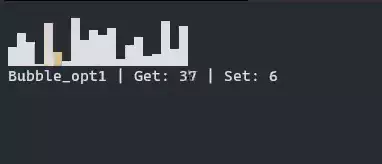
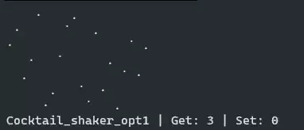
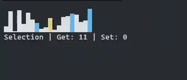
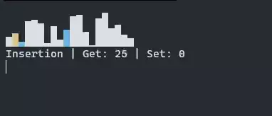
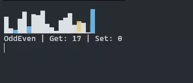
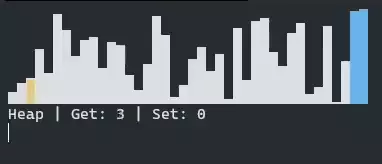
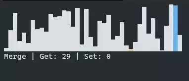
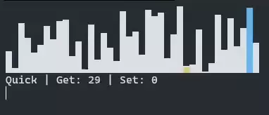
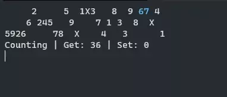
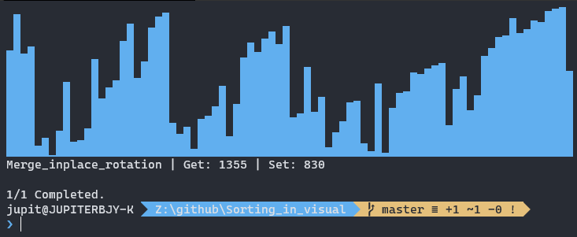

# Sorting in visual

Trying to replicate some sorting actions visually, motived by 'Sounds of Sorting'.

<video width="320" height="240" controls>
  <source src="demo/demo.mp4" type="video/mp4">
</video>

[Demo video](demo/demo.mp4) - sped up twice.

---

#### Old


Meh!

---

#### New
Sorts implemented so far:











All those videos are accelerated, factor shown on image description.

Console output speed is too slow to capture sorting under 10 seconds.

And pure Bubble, pure Cocktail-Shaker, Radix base 2 and 4 using bit shift is also implemented, probably not much use tho.

For visualization methods, horizontal_dot is extremely slow as it creates longest lines to overwrite. Bar or Dot is recommended for large N.

---

### How to:

When you run ```async_main.py```, you'll be prompted to type in N of times to sort, Sorting algorithms and visualizing method.

You can input multiple items, but Sorting algorithm section should have to be longest, as other factors are cycled with ```itertools.cycle```.

Example setup that was used for video I've created and split to above images:
```
1 3 13 6 8 5 7 9 4 10 11
20 20 20 20 20 40 40 40 30 40 40
0 1 0 0 0 0 0 0 2 0 0
```
Copy-Paste this and it should show same results, same order. Might not if new sorts are added.

---

### Implementation:

Scripts are designed to perform dynamic import for *Visualization* and *Sorting Functions*.

No visualization nor sorting is hardcoded, and will not require any modification or intervention.

#### Sorting Visualizing:
From [MutableWrapper](MutableWrapper.py) you will get clear idea of how this works.

By implementing *MutableSequence* abc to wrap a ```array.array``` one can get precise count and progressive actions/results as sorting functions progresses.

This also means not a single modification on Sorting functions, as long as it is designed to prefer main array, rather than aux.

For a future implementation of separated multiple sorting instances in parallel, all results are collected on ```asyncio.queue```.

#### Visualization:
With use of closure one can create neat personal [visualize method](VisualMethod/OutputMethods.py) - only for horizontal so far - by one-liner.

I believe it's abstract enough.

```python
horizontal_bar = create_horizontal((" ", "▁", "▂", "▃", "▄", "▅", "▆", "▇", "█"), over="█")
horizontal_num = create_horizontal((" ", *(str(i) for i in range(1, 10)), bold("X")))
horizontal_dot = create_horizontal((" ", *map(bold, ".·˙")))  # this runs too slow
```

All stock visualize methods:
```
 1  2  3  4  5  6  7  8  9 10 11 12 13 14 15 16 17 18 19 20 21 22 23 24 25 26 27 28 29 30 |100 200

                        ▁▂▃▄▅▆
                ▁▂▃▄▅▆▇███████
        ▁▂▃▄▅▆▇███████████████
▁▂▃▄▅▆▇███████████████████████
test | Get: 100 | Set: 200

                    123456789X
          123456789X          
123456789X                    
test | Get: 100 | Set: 200

                           .·˙
                        .·˙   
                     .·˙      
                  .·˙         
               .·˙            
            .·˙               
         .·˙                  
      .·˙                     
   .·˙                        
.·˙                           
test | Get: 100 | Set: 200

```
Inline methods are meant for debugging.

---

### ETC

And I'm failing to implement neither in-place merge sorts. lel.

Used Merge code from wikisort, yet it's not working for weeks. 
