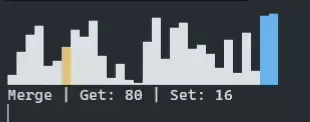

# Sorting in visual

Trying to replicate some sorting actions visually, motived by 'Sounds of Sorting'.

Therefore, I created this project to apply what I've learned from 'Introducing Python' by Bill Lubanovic. This will start off by CLI application and now working on PyQt5 for UI.

#### Old

#### New

Just like last project, I barely know about python - There's ton of things to learn to be more pythonic.
